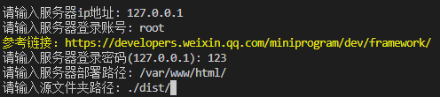

# 发布

h5 部署到服务器，在日常开发中不可或缺，算是脏活累活,身为程序员怎么没有方便的工具呢。

## 部署的步骤：

1. 推送到服务器；
2. 刷新CDN；

## 使用

```
node ./node_modules/publish2server/
```

有两种方式输入参数：

1. 通过命令行输入参数；
   在根目录下无 publish.config.js 文件，或文件内容不符合规则时，用户可以在命令行内输入参数。但是无法触发刷新 CDN 的服务；

2. 通过配置文件配置相关参数；

   1. 在根目录下创建 publish.config.js 文件，并正确的写入参数。

   2. <font color="red">**_强烈建议，不要在配置文件里写 password_dangerous 字段。如果不小心将配置文件发到公网，服务器账号密码泄露是非常严重的。_**</font>服务器的密码等信息，在没有配置的时候，可以在命令行内输入。可以将密码等关键信息单独写在一个需要登录的在线文档里。然后在生命周期里输出或打开文档链接，方便查看。 4.支持通过接口的形式获取服务器信息。

   3. CDN 每天刷新次数是有限制的，如果没有必要刷新 CDN，将 refresh 置为空数组。

   4. 默认取根目录下 publish.config.js 文件。也可以在命令行后面加入--config=配置文件的形式指定配置文件。例如：

   ```
    node ./node_modules/publish2server/ --config=publish.config.dev.js

   ```

   其他：因为刷新 CDN 涉及密钥管理，所以只能写后端刷新接口。如果想要使用本插件的刷新逻辑，需要保持接口以及入参一致。
   api 接口为 POST 形式。后端刷新成功返回的 code 为 10000,其他状态返回 msg 值。

### 通过命令行输入参数:

</img>

### 通过配置文件配置相关参数

在根目录下创建<lt>publish.config.js</lt>文件。

配置参数如下：

```
const publishConfig = {
        "push": [
            {
                "server":{
                    <!-- 见server配置 -->
                },
                "hook": {
                    <!-- 见hook配置 -->
                }
            }
        ],
        "refresh": [
             {
                 "api": {
                    <!-- 见api配置 -->
                 },
                 "hook": {
                    <!-- 见hook配置 -->
                 }
             }
        ]
}

module.exports = publishConfig;
```

### server 配置

| 属性               | 含义                                                     |
| ------------------ | -------------------------------------------------------- |
| name               | 服务器名称                                               |
| host               | 服务器 host                                              |
| port               | 服务器 port                                              |
| username           | 服务器登录账号                                           |
| password_dangerous | 服务器登录密码（强烈建议通过命令行输入，不要写在配置里） |
| path               | 服务器部署路径                                           |
| origin             | 源文件文件路径                                           |

示例代码：

```
    //服务器名称
    "name": '正式环境',
    //地址
    "host": '120.0.0.1',
    //端口
    "port": 22,
    // 服务器登录账号
    "username": 'root',
     // ！！！谨慎使用,强烈不建议写在配置里！！！
    "password_dangerous": '',
    // 服务器部署路径
    "path": '/var/www/html/',
    // 源文件夹
    "origin": "./dist/"
```

### api 配置

| 属性     | 含义                   |
| -------- | ---------------------- |
| api_host | 接口 host              |
| api_port | 接口 port              |
| api_path | 接口 path              |
| type     | 刷新类型(见 type 类型) |
| path     | 刷新目录               |

### type 参数：

| 参数         | 值                                                          |
| ------------ | ----------------------------------------------------------- |
| File         | 文件刷新                                                    |
| Directory    | 目录刷新                                                    |
| Regex        | 正则刷新                                                    |
| IgnoreParams | 去参数刷新（去掉 URL 中问号之后的参数，然后再执行刷新操作） |

和阿里云刷新 CDN 方法的入参一致。

示例代码：

```
    // 刷新CDN的接口
    "api_host": "127.0.0.1",
    "api_port": 22,
    "api_path": "/refreshCdn",
    // 刷新类型
    "type": "Directory",
    // 刷新目录
    "path": "https://www.aliyun.com/client/"
```

### 生命周期(hook)

| 生命周期          | 含义             |
| ----------------- | ---------------- |
| beforePush        | 推送到服务器前   |
| beforeInputSecret | 输入服务器密码前 |
| afterPush         | 推送到服务器完成 |
| afterRefresh      | 刷新 CDN 之后    |

### 生命周期中可以执行的选项

| 方法    | 含义                                                         |
| ------- | ------------------------------------------------------------ |
| log     | 输入提示文案，例如在线文档链接                               |
| open    | 打开网页                                                     |
| qrcode  | 在控制台输出二维码                                           |
| request | 可以在将服务器的信息存在接口中（在 beforePush 中执行该方法） |

### hook 以及配置的示例代码：

```
           beforePush: {
                         request: {
                            hostname: 'http://localhost',
                            port: "8848",
                            path: 'api/secret',
                            key: "key",
                            // 接口请求的标识，自定义
                            appkey: "",
                        },
                        log: {
                            // 此处可以放一个线上的文档，方便用户查看相关参数
                            text: "参考文档： https://account.aliyun.com/login/login.html",
                        },
                        open: {
                            <!-- 打开网页前的延时时间 -->
                            delay: 2000,
                            // 打开网页
                            url: "https://account.aliyun.com/login/login.html"
                        }
                    }
```

### hook 中 request 的配置

```
    {
        hostname: 'http://localhost',
        port: "8848",
        path: 'api/secret',
        key: "key",
        // 接口请求的标识，自定义
        appkey: ""
    }
```

其他：如果想要使用本插件的从接口获取服务器信息的逻辑，需要保持接口以及入参一致。
api 接口为 GET 形式，入参为 key=自定义标识,成功返回数据结构如下。

```
    {
        "code":1000,
        "data":
            {
                "id":"1702535025032",
                "name":"正式服务器",
                "key":"random-key",
                "password_dangerous":"password"
            }
    }
```
